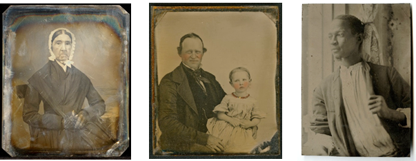
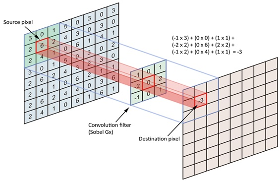
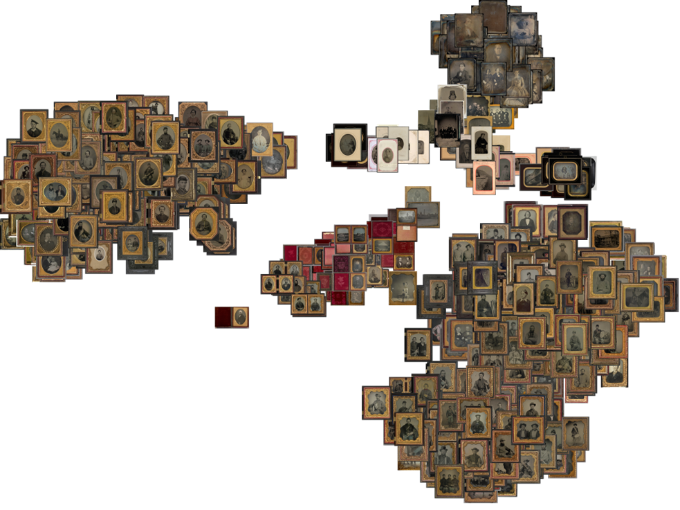

# Machine Learning para la identificación del proceso fotográfico

## INTRODUCCIÓN

Cuando en un archivo histórico nos acercarnos a una fotografía desconocida, nos surgenvarias preguntas: ¿Qué representa la imagen? y ¿de qué año es?, ¿Quién es el autor o autora?, ¿Cuál es su tamaño, material de soporte, color y técnica con la que fue creada? esta información nos permite contextualizar la fotografía y plantear indagaciones más amplias y complejas. En este proyecto se reentrenó a la red neuronal convolucional Mobilenet para identificar el proceso fotográfico de las primera imagenes creadas en el siglo XIX, conocidas como imagenes de cámara.

Para concer más de este proyecto puedes leer este [artículo](https://www.academia.edu/92501941/Identificación_de_procesos_fotográficos_mediante_técnicas_de_aprendizaje_de_máquina)

Las redes neuronales convolucionales (RNC) son dispositivos para el análisis de información visual que han tenido un desarrollo muy acelerado en los últimos diez años. La convolución es la operación en la que el dígito que corresponden a cada pixel de la imagen se multiplica por un filtro o kernel, el resultado es una versión de la imagen en la que se destacan algunas de sus características y se simplifican otras. Este proceso se repite en las diferentes capas de la red y progresivamente se obteniene un mapa de características, equivalente a una versión reducida y destilada de la imagen, este mapa se introduce a la última capa de la red, conocida como clasificador y de esta manerase identifica su contenido.

Las redes más comunes han sido entrenadas con Imagenet, un conjunto de datos en el que se muestran personas, acciones, objetos, lugares, animales y vegetales clasificados en 20,000 categorías diferentes.

En este proyecto la red Inception fue reentrenada para diferenciar el proceso fotográfico en imágenes históricas. Se utilizaron 600 fotografías de tres procesos diferentes: ambrotipo, daguerrotipo y ferrotipo.

El resultado es una red con un porcentaje de 85 % de precisión en la fase de entrenamiento y de 75 % en la de validación.

Una técnica de visualización basada en la reducción multidimensional permite observar que la identificación de las imágenes se basa inicialmente en aspectos como la forma de montaje y presentación (estuche, marco o tarjeta) y solo de forma secundaria en las características relacionadas con el proceso fotográfico, a futuro será necesario intentar que la red enfatice este tipo de característica ya que son las que más información aprtan a la identificación.

